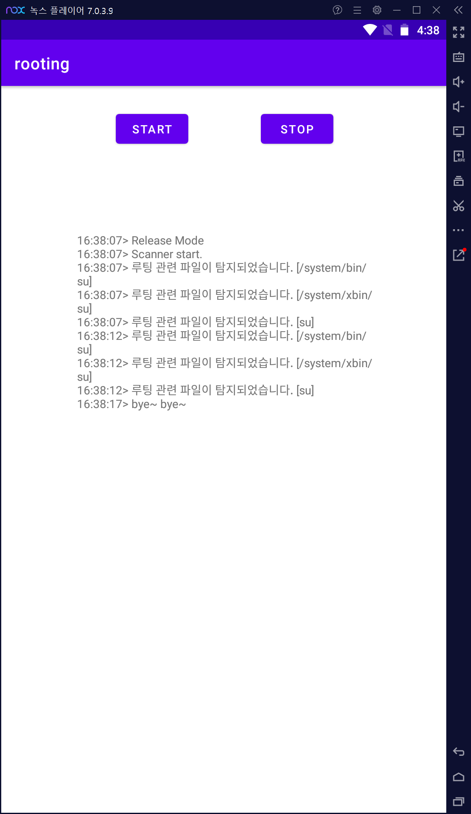
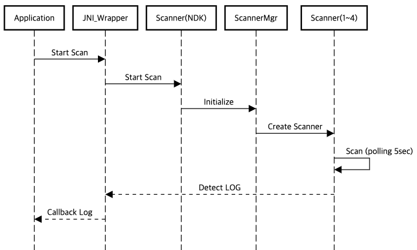

# ndk_rooting 
* Android NDK 기반의 간단한 루팅 탐지 프로젝트
* 안드로이드 권한에 관한 이슈가 존재함 (예, QueryAllPackages)
## 사용 방법
### 빌드
```
./gradlew assemble
```
* Build Output Path : Default<br> e.g) {parent_path}/rooting/app/build/outputs/apk/release/하위

### 설치
```
adb install app-release.apk
```

## 개발 상세
### 환경
* macOS Monterey 12.6.1
* Android Studio Dolphin | 2021.3.1 Patch 1
* NDK 21.4.7075529
* Gradle 7.3.3
* Sdk (min 21, target 32)
* Cmake 3.18.1

### Code Convention
* java : camelCase
* c/c++ (ndk) : Upper CamelCase + snake_case + google code convention

### 구현 기능
#### 탐지
* RootBeer 참고한 탐지기능 https://github.com/scottyab/rootbeer
1. Binary 탐지
	- 특정 Binary의 존재 여부를 확인
2. Pacakge 탐지
	- 설치된 Package를 pm list info 명령어로 특정 패키지 설치여부를 판단한다.
		- <span style="color:red;"> *권한 이슈 존재*</span>
3. Permission 탐지
	- 특정 Directory에 Other 사용자 Write 권한이 존재하는지 탐지한다.
4. which를 이용한 binary 탐지
	- which 명령어를 사용하여 특정 바이너리가 존재하는지 확인한다.
5. Properies 값을 이용한 탐지
	- getprop 를 호출하여 Properies값을 확인하여 탐지하는 방식

### Unit Test
* NDK에서 사용되는 핵심 코드를 테스트 할 수 있는 Unit Tester (Google Test 기반)
* 프로젝트 구현 과정에서 AssetManager 사용으로 인한 결합도가 높아 짐에 따라 별도의 api를 구성
* Debug Build 시 포함되며 Release Build는 미포함됨

##### 실행 방법
```
./{source_path}/glog_test 1 (1 = armv8, 2 = armv7, 3 = x86_64, 4= x86)
```

##### 스크립트
```
name=$0
input=$1
arch=

function usage {
    echo "usage: $name [type]"
    echo "  1      arm64-v8a"
    echo "  2      armeabi-v7a"
    echo "  3      x86_64"
    echo "  4      x86"
    echo "  e.g) glog_test.sh 1"
    exit 0
}

if [[ "$input" -eq 0 ]]
then
    usage
elif [[ "$input" -eq 1 ]]
then
    arch="arm64-v8a"
elif [[ "$input" -eq 2 ]]
then
    arch="armeabi-v7a"
elif [[ "$input" -eq 3 ]]
then
    arch="x86_64"
elif [[ "$input" -eq 4 ]]
then
    arch="x86"
else
    usage
fi

adb push ./scanner/build/intermediates/cmake/debug/obj/$arch/libscanner.so /data/local/tmp/
adb push ./scanner/build/intermediates/cmake/debug/obj/$arch/scanner_tester /data/local/tmp/
adb shell chmod 775 /data/local/tmp/scanner_tester
adb shell "LD_LIBRARY_PATH=${LD_LIBRARY}:/data/local/tmp /data/local/tmp/scanner_tester"
```

##### 테스트 결과


### 구성

```
Root
├── app (Test를 위한 Application)
└── scanner (루팅 탐지를 위한 NDK library)
	└── unit_test (Unit Test를 위한 GTEST 모듈)
```

#### Sequence diagram

